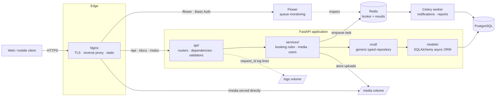

# Booking Seats API

**An async backend for restaurant table reservations — slot-based availability, conflict-safe bookings, menu pre-orders and background processing.**

*Team project. My role: **team lead** — I owned the time-slot subsystem and the entire deployment pipeline (Docker, Nginx, TLS, server operations). See [My role](#my-role) for details.*


[What it is](#what-it-is) · [Architecture](#architecture) · [Features](#features) · [Tech stack](#tech-stack) · [My role](#my-role) · [Quick start](#quick-start) · [API docs](#api-documentation)

---

## What it is

**Booking Seats** is the server side of a table-reservation product for cafés and restaurants.
A guest opens a café page, picks a date and a time slot, reserves one or more tables and — optionally —
pre-orders dishes from the menu so the kitchen can start on time. Staff manage their venue from the
same API: tables and their capacity, bookable time slots, the menu, promotional offers and photos.

The application exposes a documented REST API (OpenAPI / Swagger / ReDoc) consumed by a separate
frontend client, and runs as a containerised multi-service stack: an ASGI application behind Nginx,
PostgreSQL for persistent state, and a Celery worker with Redis for everything that must not block
an HTTP request.

### Why this is not a CRUD app

A booking is a **claim on a scarce, time-boxed resource**: a given table exists in a given slot exactly
once, and two guests can ask for it in the same millisecond. That single fact drives most of the design
decisions in this repository:

- **Availability is computed, not stored.** A table is free for a slot only if no active booking
  intersects it — so the read path resolves `café → tables → slots → bookings` instead of reading a flag
  that can go stale.
- **Invariants live in one place.** Overlap checks, capacity limits, slot validity and ownership rules
  sit in dedicated `services/` and `api/validators/` modules, so the same rule cannot drift between the
  "create booking" and "update booking" endpoints.
- **Updates are declarative.** `PATCH /booking/{id}` treats the submitted list of table-slot pairs as the
  complete, authoritative state of the reservation — the server diffs and reconciles it, rather than
  making the client orchestrate a sequence of add/remove calls that can half-fail.
- **Slow work is moved off the request path.** Notifications, media processing and scheduled jobs are
  Celery tasks, so a booking confirmation is never held hostage by an email server.

---

## Architecture

### Runtime topology

Every box below is a container in the same Docker Compose stack. Nginx is the only service exposed to
the outside world; the application, the database, the broker and the worker talk to each other over an
internal network.



A strict layer boundary keeps endpoints thin — parse, delegate, serialise — and makes the business rules
unit-testable without an HTTP client.

---

## Features

### Reservations — the core domain

- **Slot-based booking engine** — reserve one or several tables across one or several time slots in a
  single atomic request.
- **Time-slot management** — venues define their own bookable intervals; slots are validated against
  working hours and are the unit that availability, conflicts and pre-orders are all resolved against.
- **Conflict prevention** — dedicated validators reject overlapping reservations, out-of-range slots and
  over-capacity requests before anything is written.
- **Reconciling updates** — `PATCH` on a booking accepts the full desired set of table-slot pairs and the
  server computes the delta, which keeps the client stateless and the DB consistent.
- **Menu pre-orders** — dishes can be attached to a reservation so the venue can prepare in advance.
- **Venue management** — CRUD for cafés, tables, bookable slots, dishes and promotional actions.

### Authentication & access control

- **Token-based authentication** with registration, login, logout and password reset flows.
- **Role-based permissions** — guest / staff / superuser, enforced through reusable FastAPI dependencies
  rather than repeated `if` checks inside handlers.
- **Password hashing** and auth-specific Pydantic validators (email format, password strength) applied at
  the schema boundary.

### Media handling

- **Image upload and deletion** for venue photos, dishes and avatars, served directly by Nginx rather
  than through the application process.
- **Upload validation** — MIME type and size limits enforced in `media_validators` before a byte touches
  the filesystem.

### Asynchronous processing

- **Celery worker** for notifications, reports and other long-running jobs.
- **Redis** as broker and result backend.
- **Flower dashboard**, mounted behind the same reverse proxy and protected with HTTP Basic Auth, so task
  queues are observable in a running deployment instead of guessed at from logs.

### Infrastructure & deployment

- **Full containerisation** — app, Nginx, PostgreSQL, Redis, Celery worker and Flower orchestrated by a
  single Docker Compose stack; one command reproduces the entire environment from scratch.
- **Nginx as the single entry point** — TLS termination, reverse proxy to the ASGI app, direct delivery of
  static and media files, and path-based routing for the docs and the Flower dashboard.
- **HTTPS on a live domain** — the service runs on a registered domain with valid TLS certificates and
  automated renewal, not on a bare IP over plain HTTP.
- **Persistent volumes** for the database, media uploads and logs, so redeploying the stack does not
  discard state.
- **Environment-driven configuration** — every secret and connection string is read from `.env`; nothing
  environment-specific is committed to the repository.

### Observability & diagnostics

- **Structured logging** with automatic rotation and compression of archived log files, mounted out of the
  container so logs survive a redeploy.
- **Request correlation** — custom middleware attaches a `request_id` to every request and its log lines,
  which makes a single user complaint traceable end to end.
- **Built-in SQL profiler** at `/debug/sql-profiler` — a dashboard of queries issued per endpoint, used to
  catch N+1 patterns and missing indexes during development.

### Engineering quality

- **Tests against real PostgreSQL, not SQLite.** The suite provisions a dedicated schema, runs against it
  and tears it down, so tests exercise the same dialect, constraints and transaction semantics as
  production.
- **Reusable fixtures** for authenticated clients, DB sessions, log capture and request payloads.
- **Ruff** for linting and formatting, enforced automatically through **pre-commit** hooks
  (plus YAML validation, large-file and merge-conflict guards).
- **Alembic migrations** — the schema is versioned and reproducible from an empty database.
- **CI on GitHub Actions** running lint and tests on every push.

---

## Tech stack

| Layer | Technology | Why it was chosen |
| :--- | :--- | :--- |
| **Language** | Python 3.11 | Native async, mature typing, `match` statements and better tracebacks. |
| **Web framework** | FastAPI (ASGI) | Async request handling, dependency injection for auth/session wiring, and an OpenAPI schema generated from the same types that validate input. |
| **Validation** | Pydantic v2 | One source of truth for request/response contracts; domain-specific validators keep parsing and rules at the boundary. |
| **ORM** | SQLAlchemy 2.0 (async) | Explicit relationship control for the café → table → slot → booking graph, with eager-loading strategies that the SQL profiler can verify. |
| **Database** | PostgreSQL | Transactional integrity for concurrent reservations, plus schema isolation used for the test suite. |
| **Migrations** | Alembic | Versioned, reviewable, reversible schema changes generated from ORM models. |
| **Background jobs** | Celery + Redis | Keeps emails, reports and media work off the request path; Redis doubles as broker and result backend. |
| **Task monitoring** | Flower | Live visibility into queues, failures and retries — behind Basic Auth in the reverse proxy. |
| **Reverse proxy** | Nginx | TLS termination, static and media delivery, and a single entry point for the API, the docs and the Flower dashboard. |
| **TLS** | Let's Encrypt / Certbot | Free, automatically renewed certificates — no manual expiry handling in production. |
| **Runtime** | Docker & Docker Compose | Identical stack locally and on the server; no "works on my machine" gap. |
| **Testing** | pytest + pytest-asyncio | Async fixtures, schema-isolated integration tests, reusable auth and payload factories. |
| **Code quality** | Ruff + pre-commit | Linting and formatting in a single fast tool, enforced at commit time rather than in review. |
| **CI/CD** | GitHub Actions | Lint and test gates on every push to `develop` / `main`. |

Full dependency list: [`src/requirements.txt`](src/requirements.txt).

---

## My role

I worked on this project as **team lead** of the backend team, combining coordination with two areas of
hands-on ownership: the time-slot subsystem and the whole path from a local repository to a running,
publicly reachable service.

### Team lead

- Coordinated a backend team of 6 developers over about 5 weeks, breaking the product requirements
  into scoped tasks and tracking them to completion.
- Ran code review on incoming pull requests and set the branching model (`develop` / feature branches)
  and the pre-commit + CI gates the team worked under.
- Owned the integration contract with the frontend team, including the decision to make
  `PATCH /booking/{id}` take the complete table-slot set rather than incremental operations.

### Time slots — feature ownership

- Designed and implemented the slot domain: model, schemas, CRUD layer, endpoints and validators.
- Slots are the axis every other part of the booking domain resolves against, so this covered validating
  slots against venue working hours, guarding against invalid or overlapping intervals, and exposing
  availability in a form the client could render directly.

### DevOps — sole ownership

- **Containerisation.** Authored the Docker images and the Compose orchestration for the full stack —
  application, Nginx, PostgreSQL, Redis, Celery worker and Flower — including volumes for database,
  media and logs, service dependencies and startup ordering.
- **Nginx configuration.** Reverse proxy to the ASGI application, direct serving of static and media
  files, path-based routing for the docs and the Flower dashboard, and Basic Auth protection on
  monitoring endpoints.
- **Deployment.** Provisioned the server, deployed the stack to it and kept it running — the project is
  reachable as a live service, not only as a repository.
- **Domain and TLS.** Registered and configured the domain name, obtained TLS certificates and set up
  automatic renewal, so the API is served over HTTPS.

> Working across both sides of the boundary meant the code was written with its runtime in mind: the
> configuration is environment-driven, the logs are mounted out of the containers, and the stack a
> reviewer starts locally is the same one that runs on the server.

---

## Quick start

**Prerequisites:** Docker Desktop (or Docker Engine + Compose v2) running. Nothing else — no local
Python, PostgreSQL or Redis installation is needed.

```bash
# 1 — clone the repository and enter the infrastructure directory
git clone https://github.com/Tseitlin-Sofia/booking-seats-backend.git && cd booking-seats-backend/infra

# 2 — create your environment file from the template
cp .env.example .env

# 3 — build and start the whole stack in the background
docker compose up -d
```

That brings up six services: the FastAPI application, Nginx, PostgreSQL, Redis, the Celery worker and
Flower. The API is available at **http://localhost:10000/**.

**On the very first run**, apply the migrations to create the schema:

```bash
docker compose exec app alembic upgrade head
```

Then create the first superuser by sending a `POST` request to `/users/` with valid credentials — the
easiest way is straight from the Swagger UI.

### Where everything lives

| What | URL |
| :--- | :--- |
| API root | http://localhost:10000/ |
| Swagger UI | http://localhost:10000/docs |
| ReDoc | http://localhost:10000/redoc |
| Flower — Celery monitoring | http://localhost:10000/flower/ |
| SQL profiler dashboard | http://localhost:10000/debug/sql-profiler |

Flower is protected by Basic Auth. Credentials live in `infra/.htpasswd`; to set or change one:

```bash
cd infra && htpasswd ./.htpasswd admin
```

### Useful commands

```bash
# Generate a new migration after changing the ORM models
docker compose exec app alembic revision --autogenerate -m "description"

# Verify that the tables were created
docker compose exec db psql -U user -d db -c "\dt"

# Follow application logs
docker compose logs -f app

# Stop the stack (add -v to also drop the data volumes)
docker compose down
```

### Running the tests

The suite runs against a real PostgreSQL instance in an isolated schema, so the database container has to
be up — but the application container does not:

```bash
cd infra && docker compose up -d db   # 1 — start only the database
cd .. && pytest                       # 2 — run the suite from the project root
```

### Linting

```bash
ruff check          # report style and lint violations
ruff check --fix    # auto-fix everything that can be fixed
pre-commit install  # run the checks automatically on every commit
```

<!--
  BEFORE PUBLISHING — check these:

  BLOCKING — Quick start will not work without it:
  1. Does `infra/.env.example` exist and is it committed? Step 2 of the
     Quick start depends on it. If not, create one listing every variable
     read by core/config.py, with safe dummy values. This is the single
     most common reason a reviewer cannot start a project.
  2. Does the app container run migrations on start? If it does, delete the
     "on the very first run" step. If it does not, leave it.
  3. Confirm the DB user/name in the psql command match your .env defaults.

  CONTENT:
  5. Confirm the BOOKING_TABLE_SLOT and PREORDER entities and their
     cardinalities in the ER diagram against src/app/models/.
  6. Confirm library names and versions against src/requirements.txt
     (auth library, logging library, DB driver, Pydantic major version).
  7. Confirm TLS was issued via Let's Encrypt / Certbot.
  8. If the deployment is still live, add the URL near the top —
     a working link is the single most persuasive item in this file.
-->
