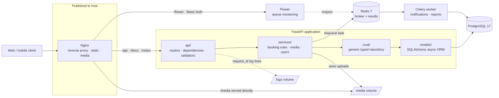
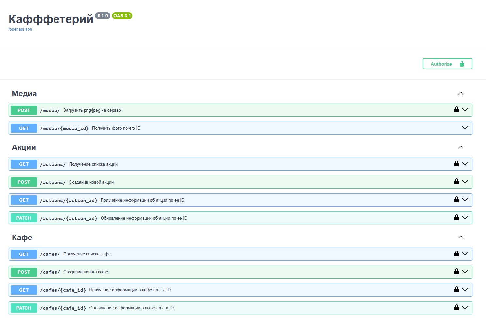
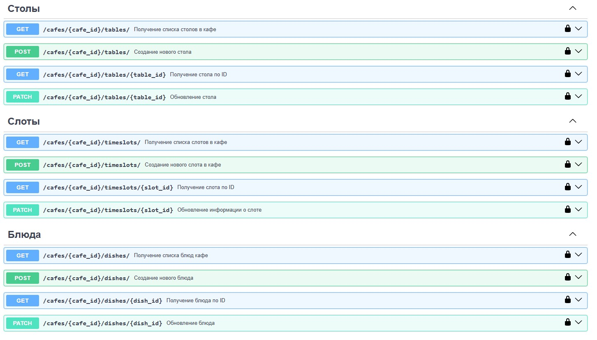
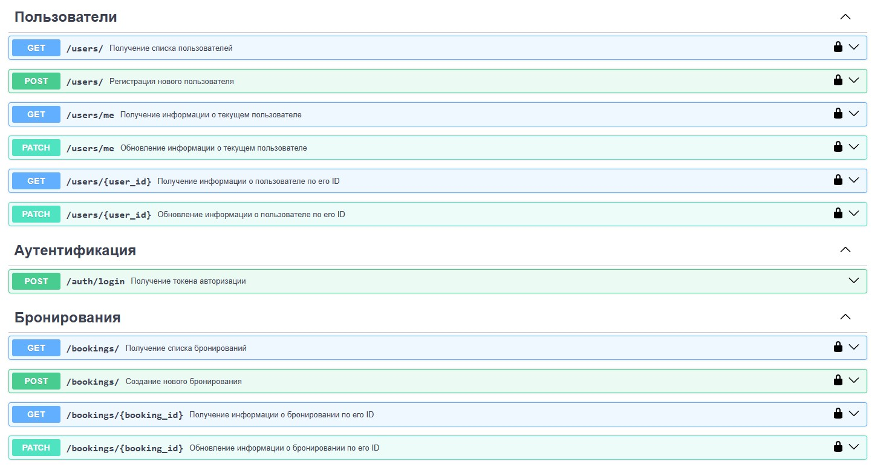

# Booking Seats API

**An async backend for restaurant table reservations — slot-based availability, menu pre-orders and background processing.**

*Team project. My role: **team lead** — I owned the time-slot subsystem and the deployment pipeline (Docker, Nginx, TLS, server operations). See [My role](#my-role) for details.*


[What it is](#what-it-is) · [Architecture](#architecture) · [Features](#features) · [Tech stack](#tech-stack) · [My role](#my-role) · [Known limitations](#known-limitations--next-steps) · [Quick start](#quick-start) · [API docs](#api-documentation)

---

## What it is

**Booking Seats** is the server side of a table-reservation product for cafés and restaurants.
A guest opens a café page, picks a date and a time slot, reserves one or more tables and — optionally —
pre-orders dishes from the menu so the kitchen can start on time. Staff manage their venue from the
same API: tables and their capacity, bookable time slots, the menu, promotional offers and photos.

The application exposes a documented REST API (OpenAPI / Swagger / ReDoc) consumed by a separate
frontend client, and runs as a containerised multi-service stack: an ASGI application behind Nginx,
PostgreSQL for persistent state, and a Celery worker with Redis for everything that must not block
an HTTP request.

### Why this is not a CRUD app

A booking is a **claim on a scarce, time-boxed resource**: a given table exists in a given slot on a
given date exactly once. That single fact drives most of the design decisions in this repository:

- **Availability is computed, not stored.** A table is free for a slot only if no active booking
  intersects it — so the read path resolves `café → tables → slots → bookings` instead of reading a flag
  that can go stale.
- **Invariants live in one place.** Overlap checks, capacity limits, slot validity and ownership rules
  sit in dedicated `services/` and `api/validators/` modules, so the same rule cannot drift between the
  "create booking" and "update booking" endpoints.
- **Updates are declarative.** `PATCH /booking/{id}` treats the submitted list of table-slot pairs as the
  complete, authoritative state of the reservation — the server diffs and reconciles it, rather than
  making the client orchestrate a sequence of add/remove calls that can half-fail.
- **Slow work is moved off the request path.** Notifications, media processing and scheduled jobs are
  Celery tasks, so a booking confirmation is never held hostage by an email server.

Contention between two guests reaching for the same table is the sharpest version of this problem, and
it is currently handled at the application layer only — see
[Known limitations](#known-limitations--next-steps) for where that stands and what closes it.

---

## Architecture

Every box below is a container in the same Docker Compose stack. **Nginx is the only service published
to the host** — the application, the database, the broker and the worker are reachable only on the
internal bridge network, addressed by service name.



**Startup ordering is explicit.** The application and the Celery worker declare
`depends_on: condition: service_healthy` against PostgreSQL and Redis, both of which define real
healthchecks (`pg_isready`, `redis-cli ping`). Containers do not merely start in order — dependants wait
until their dependencies actually accept connections, which removes the classic first-boot race where an
app comes up faster than its database.

A strict layer boundary keeps endpoints thin — parse, delegate, serialise — and makes the business rules
unit-testable without an HTTP client.

---

## Features

### Reservations — the core domain

- **Slot-based booking engine** — reserve one or several tables across one or several time slots in a
  single request.
- **Time-slot management** — venues define their own bookable intervals; slots are validated against
  working hours and are the unit that availability, conflicts and pre-orders are all resolved against.
  Creating a slot that overlaps an existing one in the same venue is rejected.
- **Booking validation** — reservations are checked against existing bookings, slot validity and table
  capacity before anything is written.
- **Reconciling updates** — `PATCH` on a booking accepts the full desired set of table-slot pairs and the
  server computes the delta, which keeps the client stateless and the DB consistent.
- **Menu pre-orders** — dishes can be attached to a reservation so the venue can prepare in advance.
- **Venue management** — CRUD for cafés, tables, bookable slots, dishes and promotional actions.

### Authentication & access control

- **JWT authentication** implemented directly on PyJWT — registration, login, logout and password
  reset flows, with no auth framework in between.
- **Role-based permissions** — guest / staff / superuser, enforced through reusable FastAPI dependencies
  rather than repeated `if` checks inside handlers.
- **Argon2 password hashing** via Passlib, with bcrypt kept configured for backward compatibility.
- **Auth-specific Pydantic validators** — email format and password strength enforced at the schema
  boundary, before a handler ever runs.

### Media handling

- **Image upload and deletion** for venue photos, dishes and avatars, served directly by Nginx from a
  shared volume rather than through the application process.
- **Upload validation** — MIME type and size limits enforced in `media_validators` before a byte touches
  the filesystem.

### Asynchronous processing

- **Celery worker** for notifications, reports and other long-running jobs, with configurable hard and
  soft task time limits.
- **Redis** as broker and result backend, password-protected.
- **Flower dashboard**, mounted under the same reverse proxy at `/flower` and protected with HTTP Basic
  Auth, so task queues are observable in a running deployment instead of guessed at from logs.

### Infrastructure & deployment

- **Full containerisation** — app, Nginx, PostgreSQL, Redis, Celery worker and Flower orchestrated by a
  single Docker Compose stack; one command reproduces the entire environment from scratch.
- **Minimal attack surface** — only Nginx is published to the host. Internal services communicate over a
  dedicated bridge network by service name; the database port is bound to loopback for test access only.
- **Health-gated startup** — dependants wait for `pg_isready` and `redis-cli ping` to pass, not merely
  for containers to exist.
- **Tuned PostgreSQL** — connection limits, shared buffers, cache size estimate, WAL buffers and
  checkpoint pacing are set explicitly rather than left at image defaults.
- **Nginx as the single entry point** — reverse proxy to the ASGI app, direct delivery of media files,
  path-based routing for the docs and the Flower dashboard, and Basic Auth on monitoring endpoints.
- **Persistent named volumes** for the database and Redis, plus bind mounts for media and logs, so
  rebuilding containers never discards state.
- **Environment-driven configuration** — every secret and connection string is read from `.env`;
  `.env.example` documents the full set of variables, and nothing environment-specific is committed.
- **Restart policies** on every service, so the stack survives a host reboot unattended.

### Observability & diagnostics

- **Structured logging** via Loguru with automatic rotation and compression of archived files,
  bind-mounted out of the containers so logs survive a rebuild.
- **Request correlation** — custom middleware attaches a `request_id` to every request and its log lines,
  which makes a single user complaint traceable end to end.
- **SQL query profiler** integrated at `/debug/sql-profiler` — a per-endpoint dashboard of issued
  queries, used to catch N+1 patterns and missing indexes during development.

### Engineering quality

- **Tests run against real PostgreSQL, not SQLite.** The harness provisions a dedicated schema, runs
  against it and tears it down, so tests exercise the same dialect, constraints and transaction
  semantics as production. Current coverage is partial — see
  [Known limitations](#known-limitations--next-steps).
- **Reusable fixtures** for authenticated clients, DB sessions, log capture and request payloads.
- **Ruff** for linting and formatting, enforced automatically through **pre-commit** hooks
  (plus YAML validation, large-file and merge-conflict guards).
- **Alembic migrations** — the schema is versioned and reproducible from an empty database.
- **CI on GitHub Actions** running lint and tests on every push.

---

## Tech stack

| Layer | Technology | Why it was chosen |
| :--- | :--- | :--- |
| **Language** | Python 3.11 | Native async, mature typing, `match` statements and better tracebacks. |
| **Web framework** | FastAPI 0.116 (ASGI) | Async request handling, dependency injection for auth/session wiring, and an OpenAPI schema generated from the same types that validate input. |
| **Validation** | Pydantic 2 + Pydantic Settings | One source of truth for request/response contracts; settings are typed and validated at startup, so a missing variable fails fast instead of at first use. |
| **ORM** | SQLAlchemy 2.0 (async, asyncpg) | Explicit relationship control for the café → table → slot → booking graph, with eager-loading strategies the SQL profiler can verify. |
| **Database** | PostgreSQL 17 | Transactional integrity for concurrent reservations, plus schema isolation used for the test suite. |
| **Migrations** | Alembic | Versioned, reviewable, reversible schema changes generated from ORM models. |
| **Background jobs** | Celery 5 + Redis 7 | Keeps emails, reports and media work off the request path; Redis doubles as broker and result backend. |
| **Task monitoring** | Flower | Live visibility into queues, failures and retries — behind Basic Auth in the reverse proxy. |
| **Auth** | PyJWT + Passlib (Argon2, bcrypt) | Hand-rolled rather than a framework: the token and permission logic stays small, explicit and reviewable, and Argon2 is the current recommendation for password storage. |
| **Reverse proxy** | Nginx | Single published entry point; serves media directly and routes the API, the docs and the Flower dashboard. |
| **Runtime** | Docker & Docker Compose | Identical stack locally and on the server; no "works on my machine" gap. |
| **Logging** | Loguru | Rotation and compression out of the box, with a format that carries the request correlation id. |
| **Testing** | pytest + pytest-asyncio | Async fixtures, schema-isolated integration tests, reusable auth and payload factories. |
| **Code quality** | Ruff + pre-commit | Linting and formatting in a single fast tool, enforced at commit time rather than in review. |
| **CI/CD** | GitHub Actions | Lint and test gates on every push to `develop` / `main`. |

Full dependency list: [`src/requirements.txt`](src/requirements.txt).

---

## My role

I worked on this project as **team lead** of the backend team, combining coordination with two areas of
hands-on ownership: the time-slot subsystem and the whole path from a local repository to a running,
publicly reachable service.

### Team lead

- Coordinated a backend team of six developers, breaking the product requirements into scoped tasks and
  tracking them to completion.
- Ran code review on incoming pull requests and set the branching model (`develop` / feature branches)
  and the pre-commit + CI gates the team worked under.
- Defined the API contract the client side consumes, including the decision to make
  `PATCH /booking/{id}` take the complete table-slot set rather than incremental operations, and
  documented the expectations that follow from it.

### Time slots — feature ownership

- Designed and implemented the slot domain: model, schemas, CRUD layer, endpoints and validators.
- Slots are the axis every other part of the booking domain resolves against, so this covered validating
  slots against venue working hours, guarding against invalid or overlapping intervals, and exposing
  availability in a form the client could render directly.

### Deployment & infrastructure — sole ownership

- **Containerisation.** Authored the Docker image and the Compose configuration for the application,
  Nginx, PostgreSQL, and the shared volumes and network. The Celery worker, Redis and Flower services
  were added by teammates.
- **Network hardening.** Reduced the published surface to Nginx alone, keeping the application, broker
  and database reachable only from inside the Compose network.
- **Database tuning.** Set PostgreSQL connection, memory and checkpoint parameters explicitly after
  hitting connection exhaustion under test load.
- **Nginx configuration.** Reverse proxy to the ASGI application, direct serving of media, path-based
  routing for the docs and the monitoring dashboard, and Basic Auth protection on monitoring endpoints.
- **Deployment and operations.** Provisioned the server, deployed the stack and kept it running through
  the project.
- **Domain and HTTPS.** Registered and configured the domain name and set up TLS on the server, so the
  API was served over HTTPS rather than on a bare IP.

> Working across both sides of the boundary meant the code was written with its runtime in mind: the
> configuration is environment-driven, the logs are mounted out of the containers, and the stack a
> reviewer starts locally is the same one that runs on the server.

---

## Known limitations & next steps

Written down deliberately: these are the things I would fix first, and knowing where a system is thin
matters as much as knowing what it does.

**Booking conflicts are enforced in the application, not in the database.** Overlaps are rejected by
validators before an insert, which covers the ordinary case but leaves a check-then-act window: two
requests can both pass validation before either one writes. Closing it properly means denormalising the
booking date and an active flag onto `BookingTableSlot` and adding a partial unique index over
`(table_id, slot_id, booking_date) WHERE is_active`, so PostgreSQL rejects the second write atomically
and the service turns the resulting `IntegrityError` into a `409`. The validator stays for the readable
error message; the constraint is what makes it correct.

**Test coverage is uneven.** The harness is solid — real PostgreSQL, isolated schema, reusable fixtures —
but the suite currently covers logging, middleware and pre-orders. The booking and slot paths are the
next ones to cover, starting with a concurrency test that asserts a `409` on the second of two competing
reservations.

**Model-level validation raises `ValueError`.** Guest-count and past-date checks live in SQLAlchemy
`@validates` hooks, which surface as `500` rather than `422`. These belong in the Pydantic schemas, with
the model layer reserved for database-level invariants.

**Indexing on the hot path.** `BookingTableSlot.table_id` and `slot_id` drive every availability
calculation and are not indexed yet; the SQL profiler is already in place to measure the difference.

---

## Quick start

**Prerequisites:** Docker Desktop (or Docker Engine + Compose v2) running. Nothing else — no local
Python, PostgreSQL or Redis installation is needed.

```bash
# 1 — clone the repository and enter the infrastructure directory
git clone https://github.com/Tseitlin-Sofia/booking-seats-backend.git && cd booking-seats-backend/infra

# 2 — create your environment file from the template
cp .env.example .env

# 3 — build and start the whole stack in the background
docker compose up -d
```

That brings up six services: the FastAPI application, Nginx, PostgreSQL, Redis, the Celery worker and
Flower. The API is available at **http://localhost:10000/**.

**On the very first run**, apply the migrations to create the schema:

```bash
docker compose exec app alembic upgrade head
```

Then create the first superuser by sending a `POST` request to `/users/` with valid credentials — the
easiest way is straight from the Swagger UI.

### Where everything lives

| What | URL |
| :--- | :--- |
| API root | http://localhost:10000/ |
| Swagger UI | http://localhost:10000/docs |
| ReDoc | http://localhost:10000/redoc |
| Flower — Celery monitoring | http://localhost:10000/flower/ |
| SQL profiler dashboard | http://localhost:10000/debug/sql-profiler |

Flower is protected by Basic Auth. Credentials live in `infra/.htpasswd`; to set or change one:

```bash
cd infra && htpasswd ./.htpasswd admin
```

### Useful commands

```bash
# Generate a new migration after changing the ORM models
docker compose exec app alembic revision --autogenerate -m "description"

# Verify that the tables were created
docker compose exec db psql -U user -d db -c "\dt"

# Follow application logs
docker compose logs -f app

# Stop the stack (add -v to also drop the data volumes)
docker compose down
```

### Running the tests

The suite runs against a real PostgreSQL instance in an isolated schema, so the database container has to
be up — but the application container does not:

```bash
cd infra && docker compose up -d db   # 1 — start only the database
cd .. && pytest                       # 2 — run the suite from the project root
```

### Linting

```bash
ruff check          # report style and lint violations
ruff check --fix    # auto-fix everything that can be fixed
pre-commit install  # run the checks automatically on every commit
```

---

## API documentation

Every endpoint is documented and interactive through the auto-generated OpenAPI schema. Once the stack
is running, the full Swagger UI is available at **http://localhost:10000/docs** and ReDoc at
**/redoc**. The interface labels are in Russian — this was a Yandex Practicum team project — but the
routes, methods and models read the same in any language.

**Endpoint overview** — media, promotional actions and cafés:



**Cafés, tables, time slots and dishes** — the venue-management surface, including the time-slot
endpoints (`/cafes/{cafe_id}/timeslots/`) I owned:



**Users, authentication and bookings** — registration, the current-user endpoint and the booking flow:


